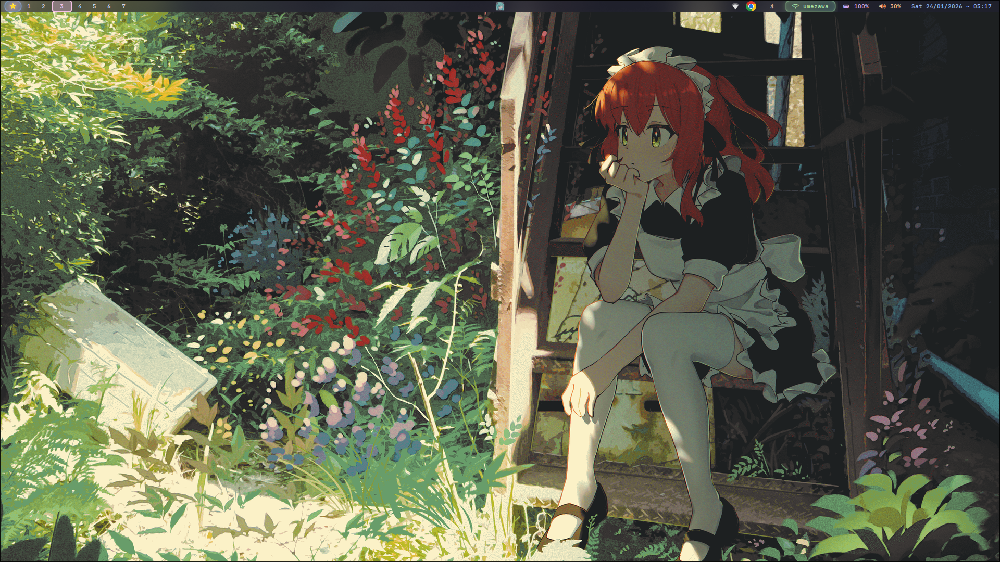
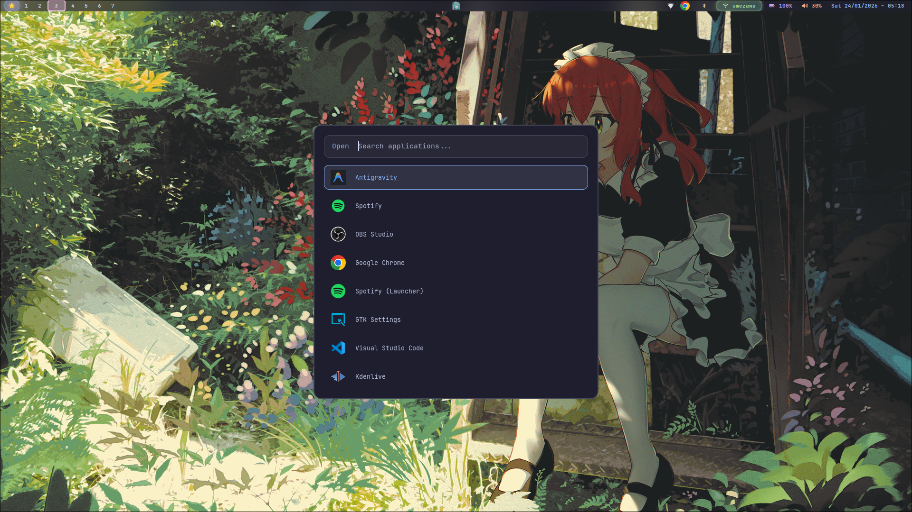
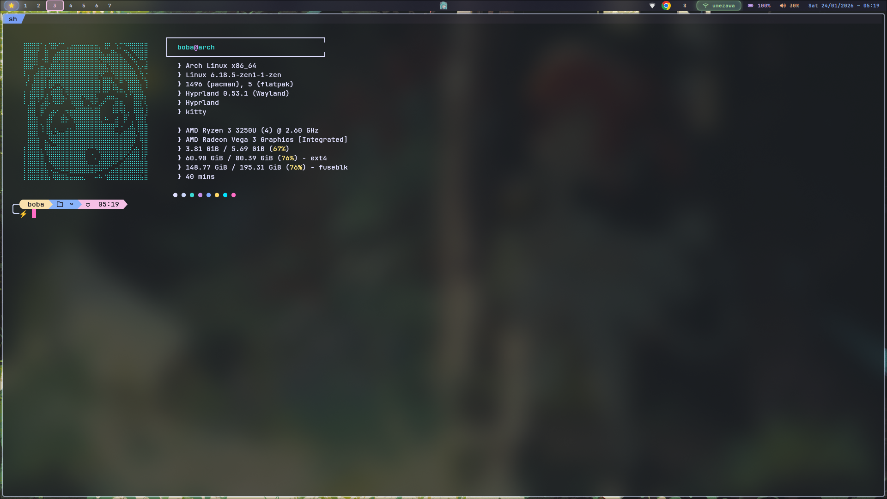
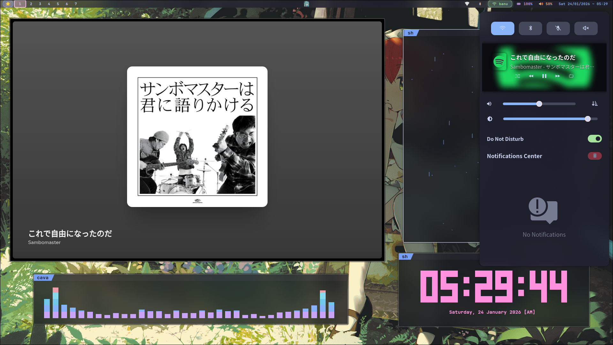
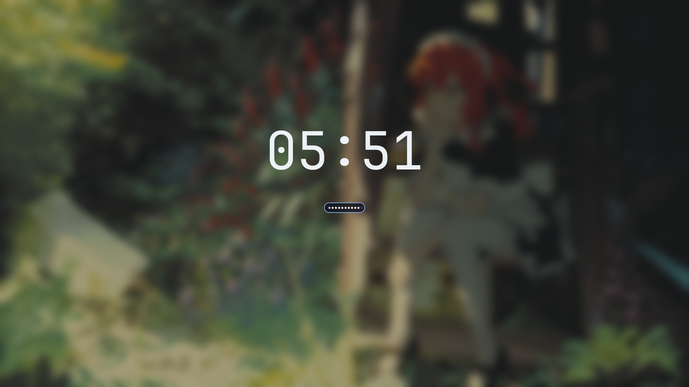
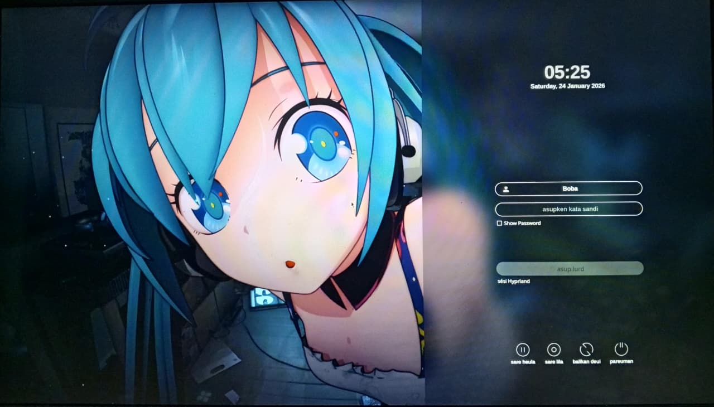
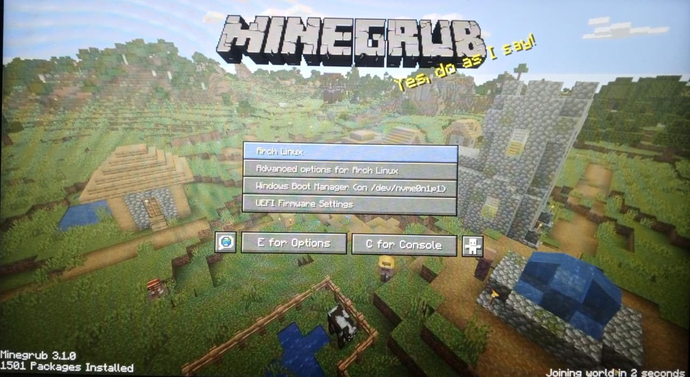
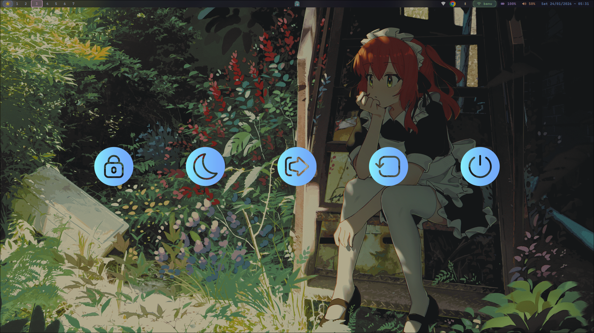

# Bobaland - My Arch-Hyprland


---

## 🇮🇩 Bahasa Indonesia

### 🌙 Filosofi :
Setup Arch Linux bertema Hatsune Miku. Terlahir dari "kegabutan" produktif seorang mahasiswa di keheningan malam, dikemas apik oleh Hyprland, dan dirapikan oleh kesenjangan. Modular, otomatis, cepat, dan estetis — bukti nyata bahwa waktu luang pun bisa bertransformasi menjadi karya yang berarti, dengan harapan tulus untuk menjadi yang paling bermanfaat bagi sesama~

### 📋 Daftar Isi
- [Pratinjau](#pratinjau)
- [Fitur](#fitur)
- [Catatan & Informasi Penting](#catatan--informasi-penting)
- [Keybindings](#keybindings-indonesia)
- [Instalasi](#instalasi)
- [Apa saja yang Terinstal](#apa-saja-yang-terinstal)
- [Repositori Dotfiles](#repositori-dotfiles)
- [Pemecahan Masalah](#pemecahan-masalah)
- [Pasca-Instalasi](#pasca-instalasi)
- [Pembaruan](#pembaruan)
- [Uninstalasi](#uninstalasi)
- [Kredit](#kredit)

### 🖼️ Pratinjau

#### 📹 Video Demo
> Tonton demo lengkap di YouTube

[](https://youtu.be/gVWVZL6gfX8)


#### 📸 Screenshots

<p align="center">
  
  
</p>

<p align="center">
  
  
</p>

<details>
<summary>📂 Lihat Screenshot Lainnya</summary>

<p align="center">
  
  
</p>

<p align="center">
  
  
</p>

</details>

### ✨ Fitur
- 🛠️ **Instalasi Interaktif**: Menu yang ramah pengguna untuk memandu proses instalasi.
- 🔒 **Aman & Terkendali**: Backup otomatis konfigurasi lama sebelum menerapkan perubahan.
- 📦 **Setup Lengkap**: Menginstal paket-paket penting seperti Hyprland, Waybar, Rofi, dan lainnya.
- 🎨 **Antarmuka Cantik**: Banner ASCII art anime kustom dan output berwarna.
- 📊 **Monitoring Progres**: Progress bar yang jelas dan logging untuk transparansi.
- 🚀 **Deployment Otomatis**: Clone dan deploy dotfiles menggunakan GNU Stow.

### 📝 Catatan & Informasi Penting
- Script ini khusus untuk **Arch Linux**.
- Pastikan koneksi internet stabil sebelum menjalankan installer.
- Installer membuat file log di `~/.cache/bobaland/` untuk keperluan debugging.

### ⌨️ Keybindings (Indonesia)
Tekan <kbd>SUPER</kbd> + <kbd>H</kbd> setelah instalasi untuk melihat daftar lengkap keybindings.

### 🚀 Instalasi
```bash
git clone --depth=1 https://github.com/bondanbanuaji/bobaland.git
cd bobaland
chmod +x install.sh
./install.sh
```

### 📦 Apa saja yang Terinstal
- **Window Manager**: Hyprland
- **Bar**: Waybar
- **Notifikasi**: SwayNC
- **Launcher**: Rofi (Wayland)
- **Terminal**: Ghostty (atau fallback), Zsh, Tmux
- **Audio**: Pipewire, Wireplumber, Cava
- **Fonts**: JetBrains Mono Nerd Font, Font Awesome, Noto Emoji
- **Tools**: Neovim, Stow, Git, Curl, Wget

### 🔗 Repositori Dotfiles
👉 **[bondanbanuaji/Dotfiles](https://github.com/bondanbanuaji/Dotfiles)**
Installer akan secara otomatis melakukan clone dan deploy dotfiles ini menggunakan GNU Stow.

### 🛠️ Pemecahan Masalah
Jika mengalami masalah:
1. Periksa file log: `~/.cache/bobaland/install_TIMESTAMP.log`
2. Pastikan sistem sudah update: `sudo pacman -Syu`
3. Jika ada konflik dotfiles, backup tersedia di `~/.config-backup-TIMESTAMP/`

---

## 🇺🇸 English

### 🌙 Philosophy :
An Arch Linux setup themed after Hatsune Miku. Born from the productive "procrastination" of a student in the silence of the night, neatly packaged by Hyprland, and organized by disparity. Modular, automated, fast, and aesthetic — real proof that spare time can transform into meaningful work, with a sincere hope to be as useful as possible to others~

### 📋 Table of Contents
- [Preview](#preview-english)
- [Features](#features-english)
- [Notes & Important Info](#notes--important-info-english)
- [Keybindings](#keybindings-english)
- [Installation](#installation-english)
- [What Gets Installed](#what-gets-installed-english)
- [Dotfiles Repo](#dotfiles-repo-english)
- [Troubleshooting](#troubleshooting-english)
- [Post-Installation](#post-installation-english)
- [Updating](#updating-english)
- [Uninstallation](#uninstallation-english)
- [Credits](#credits-english)

### 🖼️ Preview (English)

#### 📹 Video Demo
> Watch the full demo on YouTube

[](https://youtu.be/gVWVZL6gfX8)

<!-- Or embed directly if you have video file in repo -->
<!-- <video src="https://github.com/user-attachments/assets/YOUR_VIDEO_FILE.mp4"></video> -->

#### 📸 Screenshots

<p align="center">
  
  
</p>

<p align="center">
  
  
</p>

<details>
<summary>📂 Lihat Screenshot Lainnya</summary>

<p align="center">
  
  
</p>

<p align="center">
  
  
</p>

</details>

---

### ✨ Features (English)
- 🛠️ **Interactive Installation**: User-friendly menu to guide you through the process.
- 🔒 **Safe & Reversible**: Automatically backs up your existing configurations before applying changes.
- 📦 **Complete Setup**: Installs necessary packages including Hyprland, Waybar, Rofi, and more.
- 🎨 **Beautiful Interface**: Features a custom anime ASCII art banner and colored output.
- 📊 **Progress Monitoring**: Clear progress bars and logging for transparency.
- 🚀 **Automated Deployment**: Clones and deploys dotfiles using GNU Stow.

### 📝 Notes & Important Info (English)
- This script is designed for **Arch Linux**.
- Ensure you have a working internet connection before running the installer.
- The installer creates a log file in `~/.cache/bobaland/` for debugging.

### ⌨️ Keybindings (English)
Press <kbd>SUPER</kbd> + <kbd>H</kbd> after installation to view the full list of keybindings.

### 🚀 Installation (English)
```bash
git clone --depth=1 https://github.com/bondanbanuaji/bobaland.git
cd bobaland
chmod +x install.sh
./install.sh
```

### 📦 What Gets Installed (English)
- **Window Manager**: Hyprland
- **Bar**: Waybar
- **Notification**: SwayNC
- **Launcher**: Rofi (Wayland)
- **Terminal**: Ghostty (or fallback), Zsh, Tmux
- **Audio**: Pipewire, Wireplumber, Cava
- **Fonts**: JetBrains Mono Nerd Font, Font Awesome, Noto Emoji
- **Tools**: Neovim, Stow, Git, Curl, Wget

### 🔗 Dotfiles Repo (English)
👉 **[bondanbanuaji/Dotfiles](https://github.com/bondanbanuaji/Dotfiles)**
The installer automatically clones and deploys these dotfiles using GNU Stow.

### 🛠️ Troubleshooting (English)
If you encounter issues:
1. Check the log file: `~/.cache/bobaland/install_TIMESTAMP.log`
2. Ensure your system is up to date: `sudo pacman -Syu`
3. If dotfiles conflict, the backup is located in `~/.config-backup-TIMESTAMP/`

---

### 🏁 Pasca-Instalasi / Post-Installation
1. Logout dan login kembali. / Logout and login again.
2. Pilih **Hyprland** dari display manager Anda. / Select **Hyprland** from your display manager.
3. Selamat menikmati setup baru Anda! / Enjoy your new setup!

### 🔄 Pembaruan / Updating
Untuk memperbarui dotfiles: / To update your dotfiles:
1. Masuk ke folder `~/dotfiles` / Navigate to `~/dotfiles`
2. Jalankan `git pull` / Run `git pull`
3. Jalankan `stow -v .` / Run `stow -v .`

### 🗑️ Uninstalasi / Uninstallation
Untuk mengembalikan perubahan, cukup pulihkan konfigurasi yang sudah dibackup dari `~/.config-backup-*/`.
To revert changes, simply restore your backed-up configs from `~/.config-backup-*/`.

### 💖 Kredit / Credits
- r/unixporn
- JaKooLit/Hyprland-Dots
- Hyde-project/hyde
- mylinuxforwork/dotfiles
- ViegPhunt/Arch-Hyprland
